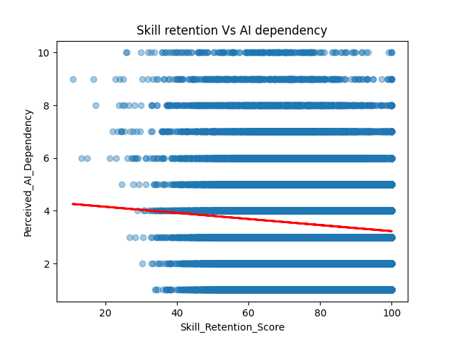
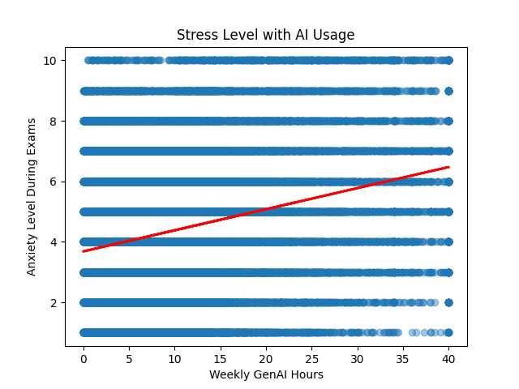

# Impact of GenAI on Students — Exploratory Data Analysis

## Overview
With the growing use of AI across sectors, I wanted to explore how it's affecting 
students specifically. As someone learning data analytics (and with a background 
in teaching), I was curious to see how GenAI usage relates to students' skill 
retention, study habits, anxiety levels, and overall dependency on AI tools.

## Dataset
- Source: Kaggle
- 50,000 rows, 16 columns
- Covers GenAI usage habits, GPA, anxiety, burnout risk, and skill retention

## Questions Explored
1. Relationship between weekly GenAI hours and traditional study hours
2. Relationship between GenAI usage and exam anxiety
3. Relationship between perceived AI dependency and skill retention
4. Distribution of perceived AI dependency across students

## Key Findings

### 1. GenAI Hours vs Traditional Study Hours

I expected that students relying more on AI would show a noticeably lower amount 
of traditional study time. The data does show this pattern, but it's weaker than 
expected — there's only a slight tendency for heavier GenAI users to study less 
in the traditional sense (correlation: -0.157).

### 2. GenAI Hours vs Anxiety

Interestingly, higher GenAI usage is associated with a mild *increase* in exam 
anxiety rather than a decrease. Students who rely more heavily on GenAI tools 
tend to experience somewhat higher anxiety during exams, though the effect is 
not strong (correlation: +0.269).

### 3. AI Dependency vs Skill Retention

I expected that heavier AI reliance would clearly reduce skill retention. 
However, the data shows only a very weak relationship (correlation: -0.084) — 
perceived AI dependency doesn't strongly predict how well students retain skills 
in this dataset.

### 4. Distribution of AI Dependency

AI is clearly playing a major role in education — students are using it to 
write code, complete assignments, and build projects. But most students don't 
perceive themselves as *highly* dependent on it: the distribution peaks around 
3-4 on a 1-10 scale, with very few students reporting high dependency (8-10). 
This suggests that despite widespread GenAI usage, most students still see 
themselves as relatively self-reliant.

## Tools Used
Python, pandas, numpy, matplotlib

## What I Learned
This was my first end-to-end data analysis project. Coming from a teaching 
background and being new to data analytics, I was especially curious about how 
AI usage relates to study habits, anxiety, and skill retention. Along the way, 
I learned how to work with pandas for cleaning and exploring data, how to build 
visualizations with matplotlib, how to interpret correlation values alongside 
charts (rather than trusting either alone), and how to debug real errors like 
file paths and syntax issues — instead of just copying code, I learned to read 
and fix it myself.
